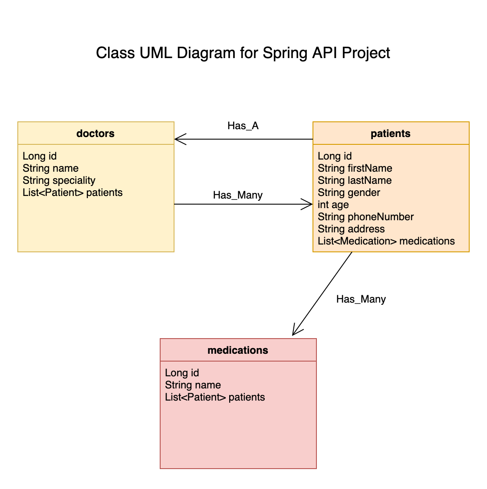

<h1> Welcome to my Spring API Project </h1>

This is a time-pressured (2 days) solo project

## Project Requirements
- Your API must demonstrate either a One-to-Many or a Many-to-Many relationship
- Controllers should have the minimum of the following routes: INDEX/SHOW/POST/DELETE
- Routes must be tested using Postman
- Create at least 2 derived queries
- Derived queries must be tested with unit tests in Maven
- Hook your derived queries up to the appropriate controller

&nbsp;
&nbsp;

&nbsp;

